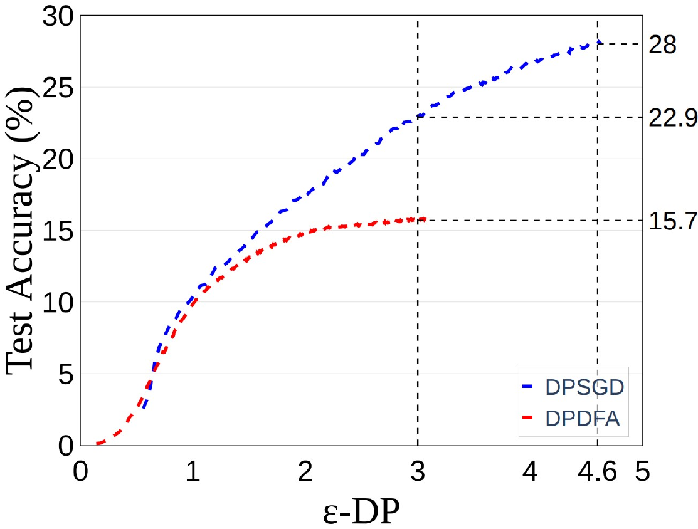
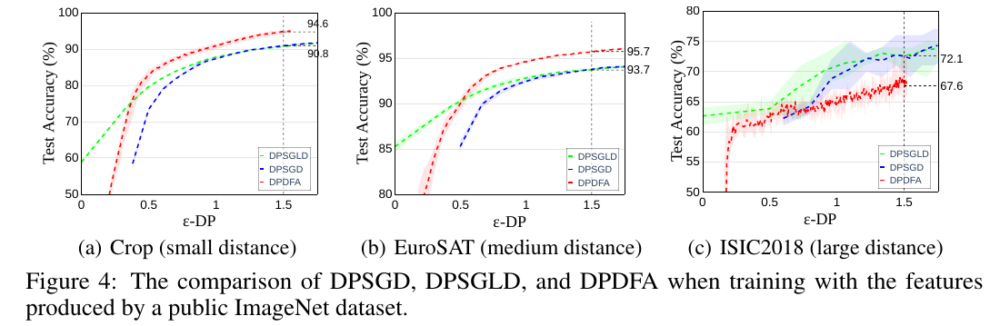

# [Self-Supervised Pretraining For Differentially Private Learning](https://arxiv.org/abs/2206.07125)

In this paper, we demonstrate by using self-supervised learning method proposed in [SimCLRv2](https://arxiv.org/abs/2006.10029), we can design more accurate classifiers with stronger privacy guarantees compared to training a traditional CNN or using handcrafted features proposed in this paper. As training a private neural network from scratch results in ending up with loose privacy guarantees and/or low accuracy, [this paper](https://arxiv.org/abs/2011.11660) proposed that by using handcrafted features, extracted with wavelet-transforms in low depths of a traditional CNN as introduced in [ScatNet](https://arxiv.org/abs/1809.06367), we can shorten the training process of the network. Thus, our privacy loss would be less, simply because these transforms can extract low-level features in images and elimiate the need to train the network to learn these features. However, we argue that by using learned features, we can further improve the utility/privacy aspects of our final private model. We test our theory by training a private classifier in the presence of  1) no public dataset , 2) a moderate-sized public dataset, 3) a large public dataset. 

A model that we use in our experiments is Harmonic Network presented in [this paper](https://bmvc2019.org/wp-content/uploads/papers/0628-paper.pdf), which uses both learned and handcrafted features, as it has shown promising performance when the training dataset is small. In this model, by replacing the traditional convolution in CNNs with harmonic blocks which contain preset Discrete Cosine Transforms and learnable parameters that learn the weighted sums of responses to the DCT filters, we can use both learned and handcrafted feautures to design our private classifier. 
To do so, we modify the model implemented in [ScatSimCLR](https://arxiv.org/abs/2108.13939) to include the DCT filters. (Refer to ```harmnet_simclr.py``` for implementation details.)

#### Scenario 1) No public dataset is avaialble 
When there is no public dataset available, we train our models from scratch on our private dataset [(CIFAR10)](https://www.cs.toronto.edu/~kriz/cifar.html). In this part we compare a traditional CNN, ScattrNet + Linear Classifier, ScatNet + CNN, HarmonicNet + Linear Classifier, HarmonicNet + CNN.

[This paper](https://arxiv.org/abs/1904.13132) proposed that by training a feature extractor on a dataset created by strongly augmenting only a single image, high-quality features can be learned without supervision. We use the same approach too when there is no public dataset available and train a feature extractor using ResNet, ScatNet and HarmonicNet on a dataset made from the single "Image B" of the mentioned paper. 

#### Scenario 2) A moderate-sized public dataset is available
In this scenario we assumed that unlabled [mini-ImageNet](https://cseweb.ucsd.edu/~weijian/static/datasets/mini-ImageNet/) is available, and we used it for training our HarmonicNet model using SimCLRv2's approach. This model was then used as our feature extractor to produce features of private datasets [CropDisease](https://www.kaggle.com/datasets/emmarex/plantdisease), [EuroSAT](https://github.com/phelber/EuroSAT), [ISIC2018](https://challenge.isic-archive.com/landing/2018/). We have also analyzed the effect of the learning distance between the public and private dataset. For comparrison, we use the ResNet model trained via the approach explained [here]().

#### Scenario 3) A large public dataset is available
In this part, we trained a ResNet50 model on unlabled ImageNet using SimCLRv2 and used is our feature extractor for training private classifiers on Crops, EuroSAT, and ISIC2018. The baseline here is a ResNet50 model trained on ImageNet in a traditional supervised manner.


## Results 
Our results for testing different scenarios mentioned above, trying a private classifier on ImageNet, and comparing different DP-enabled methods for training a private classifier are as follows.

### Scenario 1
	Utility (%) under epsilon-DP= 1 / 2

| Dataset  | Network | CIFAR10 | CIFAR100 | Crop | EuroSAT | ISIC2018
| ------------- | ------------- | ------------- | ------------- |------------- |------------- |------------- |
| None     | ScatNet + CNN  | 51.6/63.4 | 14.7/25.7 | 45.1/67.6   | 17.6/34.8   |61.2/63.7|
| 1 Image  | HarmRN18  | 61.1/64.8   | 22.3/27.1 | 70.1/74.3| 80.1/84.5   |65.1/67.2|


</td></tr> </table>

### Scenario 2

    Utility (%) under epsilon-DP= 1 / 2

| Dataset  | Network | CIFAR10 | CIFAR100 | Crop | EuroSAT | ISIC2018
| ------------- | ------------- | ------------- | ------------- |------------- |------------- |------------- |
| labeled    | ResNet18  | 68.8/72.7 | 33.8/39.1 | 62.2/77   | 69.3/76.4   |68.4/67.8|
| unlabeled  | ResNet18  | 69.1/73   | 34.9/40.8 | 75.2/78.1 | 84.9/87.6   |68.1/70.2|
| unlabeled  | HarmRN18  | 69.5/73.5 | 34.3/40.4 | 76/49.5   | 85.2/88.8   |67.7/69.8|


### Scenario 3

    Utility (%) under epsilon-DP= 1 / 2

| Dataset  | Network | CIFAR10 | CIFAR100 | Crop | EuroSAT | ISIC2018
| ------------- | ------------- | ------------- | ------------- |------------- |------------- |------------- |
| labeled    | ResNet50  | 90.4/91.1 | 61.3/65.4 | 81.1/83.7 | 82.9/85.2   |69.5/72.7|
| unlabeled  | ResNet50  | 91.6/92.7 | 63.3/69.2 | 87.7/92.3 | 92.5/94.3   |70.3/75.2|


<!-- We have demonstrated that SSP is a simple yet scalable solution to differentially private learning
regardless of the size of available public datasets. The features produced by SSP on a single image,
or a moderate/large size public dataset significantly outperform the features trained with labels in
the DP domain, let alone the non-learned handcrafted ScatNet features. Based on the learning
distance from the public dataset and the privacy budget, different private datasets may favor distinctive
DP-enabled training frameworks to train their private classifiers learned on features produced by
SSP. 
 -->


### ImageNet
In the final step, we tried to train a private classifier on ImageNet dataset. To do this, we use a pretrained ResNet50 model on [PASS] Dataset(https://github.com/yukimasano/PASS/). Utility/accuracy of this classifier is as follows.
<p align="center">
 
</p>

ImageNet features can be extracted by running ```pass_resnet.py```

### Different private learning algorithms
In this paper, we examined different DP-enabled learning algorithms, e.g, [DPSGD](https://arxiv.org/abs/1607.00133), [DPDFA](https://arxiv.org/abs/2010.03701#:~:text=Differentially%20Private%20Deep%20Learning%20with%20Direct%20Feedback%20Alignment,-Jaewoo%20Lee%2C%20Daniel&text=Standard%20methods%20for%20differentially%20private,noisy%20approximations%20to%20the%20gradient.) and [DPSGLD](https://arxiv.org/pdf/2107.08461.pdf). While DPSGLD and DPSGD can achieve similar accuracy for ```epsilon > 1 ```, DPSGLD can score a higher accuracy when ```epsilon < 0.5 ```. DPDFA can achive the best results when the learning distance between the private and public dataset is not too large (Crop and EuroSAT).

<p align="center">
 
</p>

## Datasets
We use datasets [mini-ImageNet](https://cseweb.ucsd.edu/~weijian/static/datasets/mini-ImageNet/), [CropDisease](https://www.kaggle.com/datasets/emmarex/plantdisease), [EuroSAT](https://github.com/phelber/EuroSAT), [ISIC2018](https://challenge.isic-archive.com/landing/2018/) [ImageNet](https://www.image-net.org/), [Pass](https://www.robots.ox.ac.uk/~vgg/data/pass/)

## Example Usage 
### Training a Feature Extractor with SimCLRv2
create a directory in  ```scatsim``` for datasets ```compresseddatasets``` and download datasets from [here]().
In the directory, fill the config file to choose dataset and the training parameters.
then run 
```bash
python3 ./main.py --mode unsupervised --config ./config.yaml
``` 
This code will train a model for specified epochs and save the eights of the best and the final model.
```
- fine_tune_from (if exists) = address to pre-trained model's weights
- eval_every_n_epochs = number of epochs between training the model and save a checkpoint for future use.
- dataset = pretraining dataset
- dataset_test = dataset to use for evaluation
```

Then run ```feature_extractor.py``` to extract the features with the feature extractor trained in the previous step and for the desired private dataset.
```bash
python3 ./feature_extractor.py --dataset=[dataset_name] --checkpoint_path=[checkpoint_path]
``` 
This code will produce a single ```.npz``` file containing the extracted features.

To train a private classifier using the extracted features, run ```[]_tuning.py``` codes similar ton the followuing examples.
```bash
python3 ./dpsgd_tuning.py --dataset=plant --feature-path="./features/mini_plant" --batch-size=2048 --lr=8 --noise-multiplier=2 --epochs=1 --extractor='mini'
python3 ./bayes_tuning.py --dataset=plant --feature-path="./features/mini_plant" --batch-size=1024 --lr=4 --noise-multiplier=2 --epochs=2 --extractor='mini'
python3 ./dfa_tuning.py --dataset="plant" --feature-path "./features/mini_plant" --epochs=1 --batch-size=1500 --training-method="TDFA" --lr=0.2 --sigma-privacy=0.08 --extractor='mini'
```
(--extractor is used to name the output csv file of each code containing accuracy and privacy loss in each training epoch.)


# Citation
